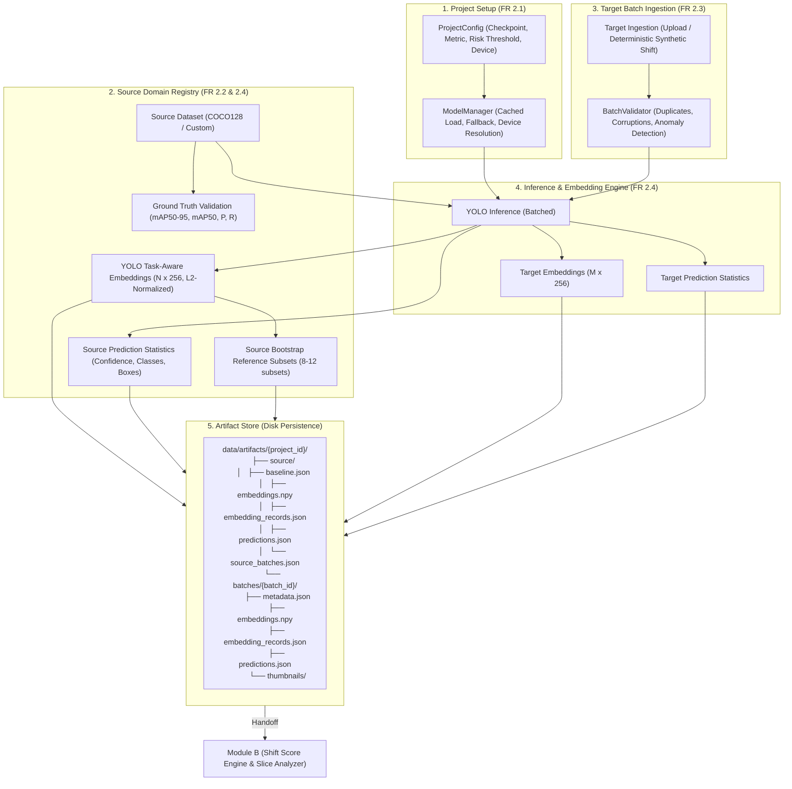

# Module A — Source & Batch Documentation

**Phụ trách:** Khúc Việt Anh (`BanhKhuc04`)  
**Phạm vi:** 
- Backend: `backend/app/modules/source/`, `backend/app/modules/batch/`
- Frontend: `frontend/pages/1_Projects.py`, `frontend/pages/2_Source_Baseline.py`, `frontend/pages/3_Batch_Analysis.py`
- Functional Requirements (docs/spec.md): 2.1, 2.2, 2.3, 2.4

---

## 1. Kiến trúc & Data Flow



---

## 2. Model & Embedding Engine

- **Model mặc định:** `yolo26n.pt` (Ultralytics v8.4.161).
- **Cơ chế fallback:** Tự động fallback sang `yolo11n.pt` hoặc `yolov8n.pt` nếu checkpoint không khả dụng.
- **Trích xuất task-aware embedding:** Sử dụng API `model.embed(images)` lấy feature representation từ lớp second-to-last (backbone/neck pooled), vector chuẩn 256 chiều, float32, L2-normalized, không chứa NaN/Inf.
- **Inference Statistics:** Tính toán phân phối confidence (mean, std, max), tỷ lệ empty detection, phân bố class, và kích thước bounding box theo chuẩn COCO (`small`: < $32^2$, `medium`: $32^2 \le \text{area} \le 96^2$, `large`: > $96^2$).

---

## 3. Quản lý Dataset & Synthetic Shift

### 3.1. Source Dataset
- Mặc định tích hợp **COCO128** tự động tải và cache qua `check_det_dataset("coco128.yaml")`.
- Tự động chạy YOLO validation để đo baseline ground-truth:
  - `mAP50-95`: ~0.4858
  - `mAP50`: ~0.6475
  - `Precision`: ~0.7337
  - `Recall`: ~0.5485

### 3.2. Source-vs-Source Reference Subsets
Source dataset được phân hoạch thành các mini-batches tham chiếu độc lập ($8 \sim 12$ subsets) kèm embedding mean và thống kê dự đoán riêng. Dữ liệu này giúp Module B xây dựng **phân phối biến động bình thường (normal-variation distribution)** để hiệu chuẩn ECDF cho Shift Score.

### 3.3. Synthetic Domain Shift Generation
Hỗ trợ tạo các target batch nhân tạo có tính tất định (deterministic với seed cố định):
1. `dark_mild`: Giảm sáng vừa phải ($0.6\times$).
2. `dark_severe`: Giảm sáng mạnh ($0.25\times$).
3. `gaussian_blur`: Mờ nét do sương mù hoặc thấu kính ($k=19, \sigma=6.0$).
4. `motion_blur`: Mờ do vật thể di chuyển nhanh ($15\times 15$ kernel).
5. `gaussian_noise`: Nhiễu hạt cảm biến ISO cao ($\sigma=35.0$).
6. `jpeg_compression`: Nén ảnh băng thông thấp (quality=18).
7. `grayscale`: Cảm biến đơn sắc/hồng ngoại.
8. `contrast_low`: Giảm tương phản (sương mù).
9. `contrast_high`: Tăng tương phản chói lóa.

---

## 4. REST API Endpoints

### Source Module (`/source`)
- `GET /source/health`: Kiểm tra sức khỏe module.
- `POST /source/project`: Lưu cấu hình project (`ProjectConfig`).
- `GET /source/project/{project_id}`: Lấy cấu hình project.
- `GET /source/projects`: Danh sách các project.
- `POST /source/model/load`: Kiểm tra tải model YOLO và thông số device.
- `POST /source/baseline`: Khởi chạy tính toán source baseline artifacts.
- `GET /source/baseline/{project_id}`: Lấy kết quả source baseline đã tính.
- `GET /source/reference-data/{project_id}`: **Handoff cho Module B** (lấy reference embeddings và bootstrap subsets).

### Batch Module (`/batch`)
- `GET /batch/health`: Kiểm tra sức khỏe module.
- `POST /batch/demo`: Tạo synthetic target batch từ source domain và chạy phân tích.
- `POST /batch/upload`: Tải lên danh sách ảnh target thực tế qua multipart/form-data.
- `GET /batch/{project_id}/{batch_id}`: Xem chi tiết batch và các prediction records.
- `GET /batch/{project_id}/{batch_id}/embeddings`: **Handoff cho Module B** (lấy target embeddings và per-image records).
- `GET /batch/{project_id}`: Danh sách các batch đã phân tích trong project.

---

## 5. Hướng dẫn chạy

### 5.1. Chạy Backend (FastAPI)
```powershell
.\.venv\Scripts\uvicorn.exe backend.app.main:app --reload --port 8000
```
Swagger UI: `http://localhost:8000/docs`

### 5.2. Chạy Frontend (Streamlit)
```powershell
.\.venv\Scripts\streamlit.exe run frontend/app.py
```
Mở trình duyệt tại: `http://localhost:8501`

### 5.3. Chạy Demo Tự Động End-to-End
```powershell
.\.venv\Scripts\python.exe scripts/demo_module_a.py
```

### 5.4. Chạy Bộ Kiểm Thử (Pytest)
```powershell
.\.venv\Scripts\python.exe -m pytest backend/app/modules/source/tests/ backend/app/modules/batch/tests/ -v
```

---

## 6. Handoff Contract cho Module B (`Chien27803`)

Module B có thể đọc dữ liệu do Module A tạo ra qua 2 cách:

1. **Qua REST API:**
   - Source Reference: `GET /source/reference-data/{project_id}`
   - Target Embeddings: `GET /batch/{project_id}/{batch_id}/embeddings`

2. **Trực tiếp từ Filesystem:**
   - Source Embeddings: `data/artifacts/{project_id}/source/embeddings.npy` (NumPy float32 matrix)
   - Source Reference Subsets: `data/artifacts/{project_id}/source/source_batches.json`
   - Source Baseline: `data/artifacts/{project_id}/source/baseline.json`
   - Target Embeddings: `data/artifacts/{project_id}/batches/{batch_id}/embeddings.npy`
   - Target Prediction Records: `data/artifacts/{project_id}/batches/{batch_id}/predictions.json`
