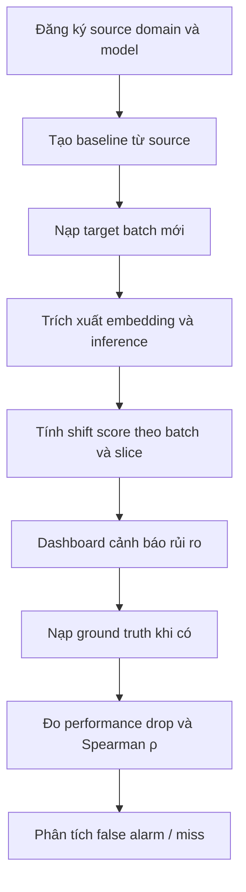
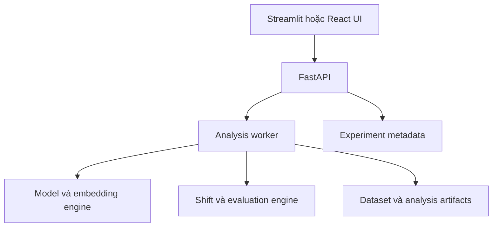

# Đề bài: Domain Shift Radar (MVP)

Với phạm vi **MVP cho Lab**, tool nên tập trung vào một mục tiêu duy nhất:

> Nhận một batch dữ liệu mới chưa có nhãn, đo mức domain shift, xác định slice rủi ro và kiểm chứng signal đó có liên hệ với performance drop của model.

## 1. Luồng hoạt động tổng thể



Điểm quan trọng: target label chỉ được sử dụng ở bước kiểm chứng cuối cùng, không được sử dụng để tính shift score.

---

# 2. Các tính năng chính

## 2.1. Project Setup

Cho phép người dùng cấu hình một phiên đánh giá.

Thông tin cần nhập:

* Tên project.
* Task type: object detection, classification hoặc segmentation.
* Model cần theo dõi.
* Model checkpoint.
* Metric chính: mAP, F1, accuracy hoặc mIoU.
* Ngưỡng performance drop không chấp nhận được.
* Danh sách class.
* Layer dùng để lấy embedding.

Ví dụ:

```text
Project: Vehicle Detection Shift Radar
Task: Object Detection
Model: YOLOv8
Classes: car, truck, bus, van
Performance metric: mAP@50
Risk threshold: giảm từ 10 điểm mAP
```

### Hoạt động

Backend load model, kiểm tra checkpoint, chạy thử một số ảnh và xác nhận đầu ra có đúng schema.

---

## 2.2. Source Domain Registry

Cho phép đăng ký dữ liệu source làm miền tham chiếu.

Thông tin có thể gồm:

* Dataset hoặc thư mục ảnh.
* Camera.
* Thành phố.
* Thời gian.
* Thời tiết.
* Sensor.
* Ground truth của source evaluation set.

### Hoạt động

Tool thực hiện:

1. Chạy inference trên source.
2. Trích xuất embedding từ backbone.
3. Tính performance baseline.
4. Chia source thành nhiều batch nhỏ.
5. Tính source-vs-source distance.
6. Xây dựng phân phối biến động bình thường.

Ví dụ:

```text
Source mAP: 0.85
Normal source distance:
P50 = 3.2
P95 = 5.8
P99 = 7.1
```

Phân phối này dùng để phân biệt biến động bình thường với domain shift.

---

## 2.3. Target Batch Ingestion

Cho phép tải batch dữ liệu production mới.

Mỗi batch cần có:

* Ảnh hoặc đường dẫn ảnh.
* Batch name.
* Thời gian thu thập.
* Metadata nếu có: camera, thời tiết, thành phố, ca ngày/đêm.
* Ground truth: chưa bắt buộc ở thời điểm phân tích shift.

Ví dụ:

```text
Batch: camera_C_night_rain
Camera: C
Time: night
Weather: rain
City: Hanoi
Labels: unavailable
```

### Kiểm tra đầu vào

Tool cần cảnh báo:

* Batch quá nhỏ.
* Ảnh lỗi hoặc không đọc được.
* Metadata thiếu.
* Kích thước ảnh bất thường.
* Dữ liệu trùng lặp với source.
* Target vô tình chứa ảnh training.

---

## 2.4. Embedding và Inference Engine

Đây là module chạy model trên source và target.

Nó tạo hai nhóm đầu ra:

### Task-aware embedding

Lấy feature từ backbone hoặc neck của model:

```text
Image → YOLO backbone → embedding vector
```

Embedding này được dùng để so sánh source và target.

### Prediction statistics

Thu thập:

* Confidence distribution.
* Số lượng detection trên mỗi ảnh.
* Phân bố class.
* Kích thước bounding box.
* Tỷ lệ ảnh không có detection.
* Model uncertainty.

Những thống kê này giúp giải thích vì sao batch bị cảnh báo.

---

## 2.5. Shift Score Engine

Đây là chức năng trung tâm.

MVP nên chạy song song hai signal:

### Signal A: Embedding shift

Khuyến nghị dùng MMD hoặc Fréchet distance giữa:

$$
Embedding_{source}
\quad\text{và}\quad
Embedding_{target}
$$

Raw distance được chuẩn hóa bằng phân phối source-vs-source:

$$
ShiftScore =
ECDF_{source-source}(D_{source,target}) \times 100
$$

Ví dụ:

```text
Shift score = 97
```

Điều này có nghĩa khoảng cách của target lớn hơn 97% các biến động bình thường trong source, không có nghĩa dữ liệu khác source 97%.

### Signal B: Prediction shift

So sánh thay đổi trong đầu ra model:

* Confidence giảm.
* Tỷ lệ ảnh không phát hiện được đối tượng tăng.
* Phân bố class thay đổi.
* Số bounding box trên mỗi ảnh thay đổi.
* Tỷ lệ box nhỏ tăng mạnh.

### Kết quả

```text
Embedding shift: 97/100
Confidence shift: 82/100
Prediction distribution shift: 74/100
Overall shift score: 89/100
```

Ở bản đầu, nên hiển thị từng signal riêng. Chỉ tạo `OverallScore` khi đã có cách đặt trọng số và validation rõ ràng.

---

## 2.6. Slice Analyzer

Chức năng này trả lời:

> Phần nào của batch đang gây ra shift?

MVP nên ưu tiên **metadata-based slicing**, vì dễ giải thích và đánh giá hơn clustering tự động.

Các slice có thể gồm:

* Camera.
* Day/night.
* Sunny/rain/fog.
* Thành phố.
* Sensor.
* Độ sáng.
* Độ blur.
* Nhóm kích thước object.
* Class đối tượng.

Ví dụ:

| Slice        | Số ảnh | Shift score | Confidence trung bình |
| ------------ | -----: | ----------: | --------------------: |
| Day          |    500 |          24 |                  0.81 |
| Night        |    400 |          79 |                  0.61 |
| Night + rain |    100 |          96 |                  0.42 |

Tool phải cho phép drill-down từ batch xuống slice rồi xuống danh sách ảnh có score cao nhất.

---

## 2.7. Risk Dashboard

Dashboard chính nên hiển thị:

### Tổng quan batch

* Shift score.
* Risk level.
* Số ảnh.
* Domain metadata.
* Model version.
* Thời điểm phân tích.

### Phân loại rủi ro

| Trạng thái | Ý nghĩa                                               |
| ---------- | ----------------------------------------------------- |
| Normal     | Nằm trong biến động thông thường của source           |
| Watch      | Có shift nhưng chưa đủ bằng chứng về performance risk |
| High risk  | Shift lớn và signal từng liên hệ với performance drop |
| Critical   | Dự đoán performance drop vượt ngưỡng cho phép         |

Không nên đặt ngưỡng `30/60/90` tùy ý. Ngưỡng cần dựa trên source bootstrap và kết quả validation.

### Biểu đồ cần có

* Shift score theo domain.
* Shift score so với performance drop.
* Performance theo từng target.
* Ranking slice rủi ro.
* Confidence distribution source–target.
* Ảnh đại diện của các slice bị shift.

---

## 2.8. Ground Truth và Performance Evaluation

Khi đã gán nhãn một phần target, người dùng upload annotation vào tool.

Tool sẽ:

1. Kiểm tra annotation schema.
2. Chạy evaluator.
3. Tính metric của target.
4. So sánh với source baseline.
5. Tính performance drop.

$$
PerformanceDrop =
Performance_{source} - Performance_{target}
$$

Ví dụ:

```text
Source mAP: 0.85
Target mAP: 0.62
Performance drop: 0.23
```

Đối với detection, nên hiển thị thêm:

* mAP theo class.
* Precision và recall.
* Performance theo kích thước object.
* False positive và false negative.
* Performance theo slice.

---

## 2.9. Correlation Validator

Đây là module chứng minh shift signal có giá trị.

Tool tổng hợp từng domain/slice:

| Domain       | Shift score | Performance drop |
| ------------ | ----------: | ---------------: |
| Camera B     |          32 |             0.04 |
| Rain         |          68 |             0.18 |
| Night        |          91 |             0.36 |
| Night + rain |          97 |             0.48 |

Sau đó tính:

$$
\rho =
Spearman(ShiftScore, PerformanceDrop)
$$

Kết quả nên gồm:

```text
Spearman ρ: 0.87
p-value: 0.004
Số domain/slice: 12
```

Mặc dù yêu cầu tối thiểu chỉ có ba target, nên tạo khoảng **8–12 domain/slice** để kết quả Spearman có ý nghĩa hơn. Chỉ ba điểm dữ liệu sẽ rất yếu.

---

## 2.10. False Alarm và Miss Explorer

Tool tự động phát hiện các trường hợp radar dự báo sai.

### False alarm

```text
Shift score cao
nhưng
Performance drop thấp
```

Ví dụ:

```text
Camera D:
Shift score = 92
mAP drop = 0.02
```

Có thể do màu sắc hoặc sensor thay đổi nhưng feature phục vụ nhận diện đối tượng vẫn đủ tốt.

### Miss

```text
Shift score thấp
nhưng
Performance drop cao
```

Ví dụ:

```text
Small vehicles:
Shift score = 35
mAP drop = 0.28
```

Có thể global embedding không nhạy với nhóm xe nhỏ.

### Màn hình phân tích

Mỗi case nên hiển thị:

* Batch/slice.
* Shift score.
* Performance drop.
* Ảnh đại diện.
* Thay đổi feature và prediction.
* Nhận định nguyên nhân.
* Hướng cải thiện signal.

---

## 2.11. Report Export

Cho phép xuất báo cáo HTML hoặc PDF gồm:

1. Mô tả source và target.
2. Model và evaluation metric.
3. Phương pháp tính shift score.
4. Bảng kết quả theo domain/slice.
5. Spearman correlation.
6. False alarm và miss.
7. Ảnh minh họa.
8. Kết luận và giới hạn.
9. Đề xuất hành động.

Đây cũng là report dùng để nộp bài hoặc trình bày demo.

---

# 3. Các màn hình của MVP

| Màn hình               | Chức năng                            |
| ----------------------- | ------------------------------------- |
| Projects               | Tạo và quản lý experiment            |
| Source Baseline        | Đăng ký source, model và baseline    |
| Batch Analysis         | Upload target và chạy shift analysis |
| Slice Explorer         | Xem slice, ranking và ảnh bất thường |
| Performance Evaluation | Upload label và đo performance       |
| Correlation Report     | Spearman, calibration và biểu đồ     |
| Failure Analysis       | False alarm và miss                  |
| Export Report          | Xuất kết quả bài lab                 |

---

# 4. Kiến trúc đề xuất cho MVP



Stack phù hợp:

* UI: **Streamlit** để hoàn thành lab nhanh; React nếu nhóm có đủ thời gian.
* Backend: FastAPI.
* ML: PyTorch, Ultralytics, NumPy, SciPy, scikit-learn.
* Database: SQLite cho demo hoặc PostgreSQL nếu nhiều người sử dụng.
* Artifact storage: filesystem theo project; có thể nâng lên MinIO sau.
* Deployment: Docker Compose.

Với MVP, chưa cần Kafka, Kubernetes, real-time streaming hoặc hệ thống alert production.

---

# 5. Phạm vi ưu tiên triển khai

## Bắt buộc

* Đăng ký source và model.
* Upload target batch.
* Trích xuất embedding.
* Tính shift score.
* Phân tích theo slice.
* Upload ground truth.
* Đo performance drop.
* Tính Spearman \(\rho\).
* Phát hiện false alarm/miss.
* Dashboard và export report.

## Nên có

* So sánh nhiều shift method.
* Bootstrap confidence interval.
* Drill-down tới ảnh.
* Risk threshold có thể cấu hình.
* Lưu lịch sử experiment.

## Để sau MVP

* Streaming monitoring.
* Alert qua email/Slack.
* Automatic retraining.
* Active learning workflow.
* Automatic semantic slice discovery.
* Multi-user và RBAC.
* Model registry hoàn chỉnh.

Kết quả cuối cùng của tool không nên chỉ là dòng **"batch này khác source"**, mà phải tạo được kết luận có thể hành động:

> Batch `camera_C/night/rain` có shift score 96/100, model mAP giảm 31 điểm; đây là slice rủi ro cao nhất và cần được ưu tiên gán nhãn, review hoặc bổ sung vào tập retraining.
